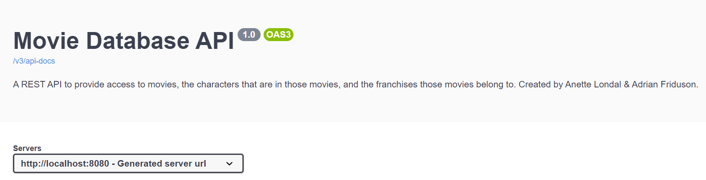
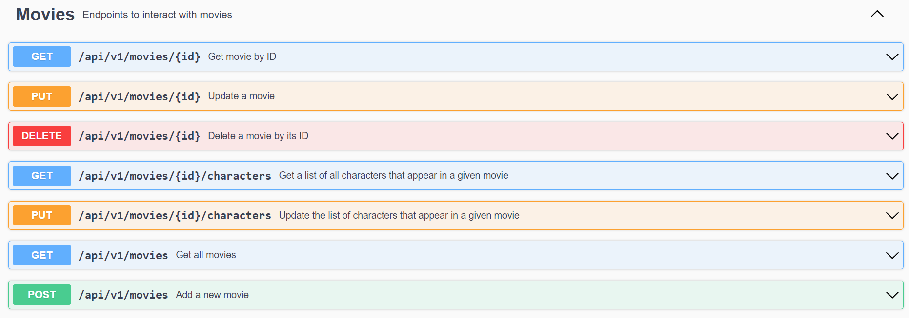
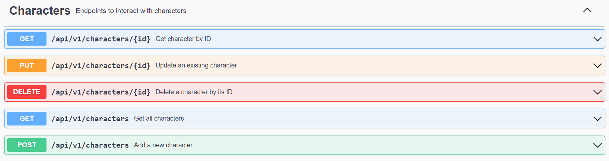
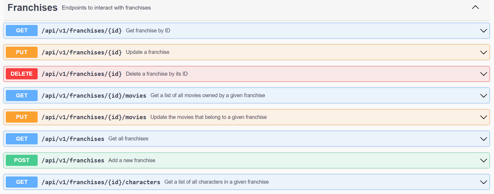
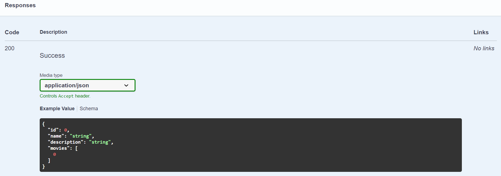
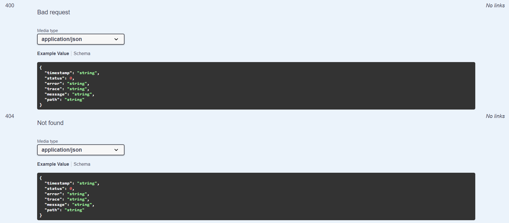
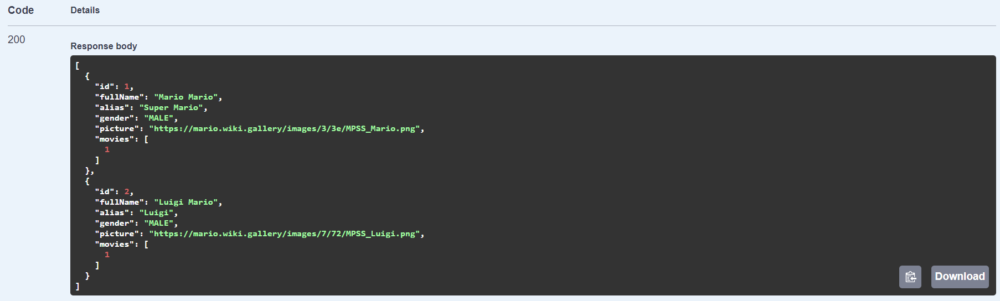
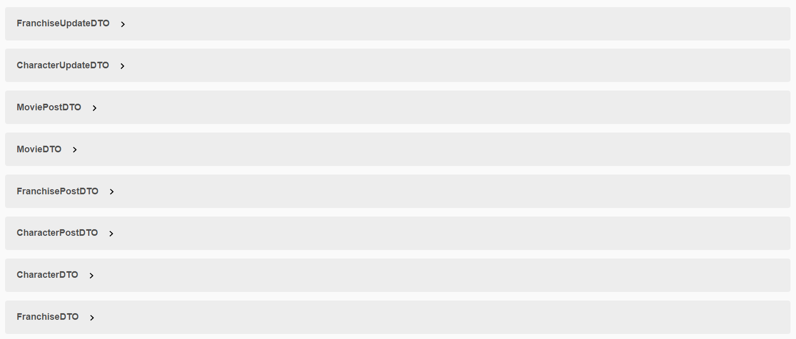

# Spring Assignment

[](https://github.com/RichardLitt/standard-readme)
[](https://gitlab.com/LucasPersson/web-api-and-database-with-spring/-/pipelines)


Create a Web API and database with Spring.

## Table of Contents

- [Overview](#overview)
- [Database](#database)
- [Swagger](#swagger)
- [Maintainers](#maintainers)
- [License](#license)

## Overview

A REST API to provide access to movies, the characters that are in those 
movies, and the franchises those movies belong to.

It is designed to be separated to represent layers of architecture.

A request is handled by Spring and is resolved in a controller. The 
controller calls a service to perform some business logic, which involves 
data access. The result is then mapped to a suitable data transfer object (DTO) 
for display purposes.

## Database

A data.sql file is included in order to populate the database with 2 franchises, 4 movies and 13 characters. 

## Swagger

Swagger has been configured to be as complete as needed. This includes:

- API name and description
- API version
- Controller name and description
- Endpoint name and description
- Response types for failures and successes
- All required data structures are represented as DTOs

> API name, description, and version



> Controller name and description





> Response types for failures and success





> All required data structures (no entities shown to client)



The configuration for the API details and the controller details was done 
with @Info and @Tag:

```java
@OpenAPIDefinition(info = @Info(
        title = "Movie Database API",
        description = "A REST API to provide access to movies, the characters that are in those movies, and the franchises those movies belong to. Created by Anette Londal & Adrian Friduson.",
        version = "1.0"
))
public class AssignmentWebApiApplication {
```

```java
@Tag(name = "Characters", description = "Endpoints to interact with characters")
public class CharacterController {
```

## Maintainers

[Anette Londal (@Ms.Niffi)](https://gitlab.com/Ms.Niffi), [Adrian Friduson (@HessianThespian)](https://gitlab.com/HessianThespian)

## Contributing

PRs accepted.

Small note: If editing the README, please conform to the [standard-readme](https://github.com/RichardLitt/standard-readme) specification.

## License

MIT © 2022 Anette Londal, Adrian Friduson